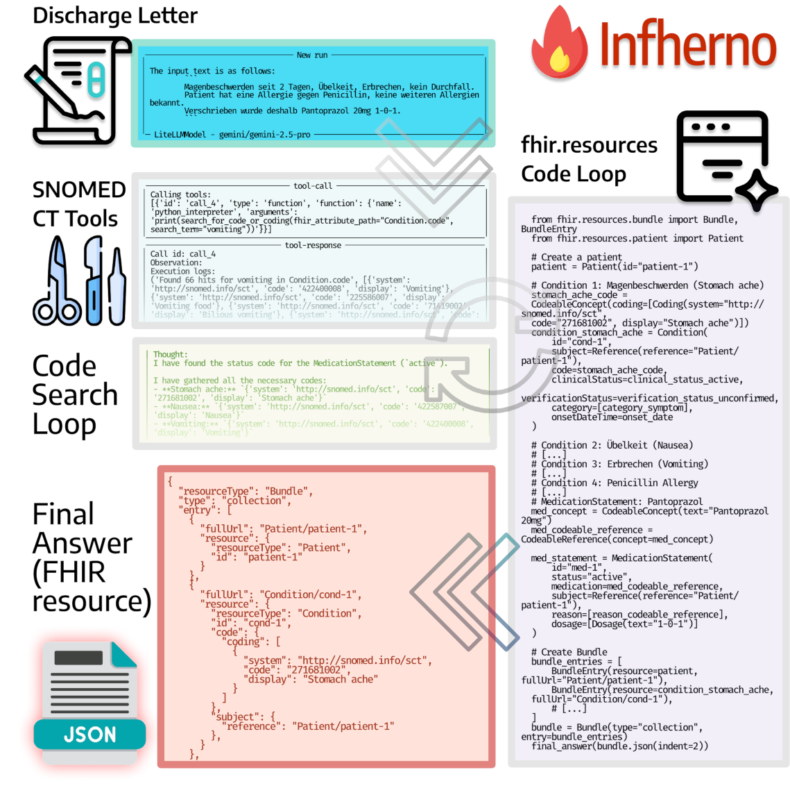

# 🔥 Infherno

Infherno is an end-to-end agent that transforms unstructured clinical notes into structured FHIR (Fast Healthcare Interoperability Resources) format. It automates the parsing and mapping of free-text medical documentation into standardized FHIR resources, enabling interoperability across healthcare systems.

<p align="center">
  
</p>

Built on Hugging Face’s SmolAgents library, Infherno supports multi-step reasoning, tool use, and modular extensibility for complex clinical information extraction.

Infherno also provides ontology support for SNOMED CT and HL7 ValueSets using Retrieval-Augmented Generation (RAG). This allows the agent to ground extracted medical concepts in standardized terminologies, ensuring semantic consistency and accurate coding in line with clinical data standards.

## Live Demo

**Gradio Demo Video**: [See the clip here](https://myweb.rz.uni-augsburg.de/~freijoha/Infherno_Gradio_Demo.mp4).  
**Public Demo**: A public demo is available at [https://infherno.misit-augsburg.de/](https://infherno.misit-augsburg.de/). Note that it does not use Gemini, but a smaller Llama 3.3 (70B, quantized) model, and an internal Snowstorm instance.

~~Our Gradio demo is accessible via [Hugging Face Spaces](https://huggingface.co/spaces/nfel/infherno)~~. Although a Hugging Face Spaces instance was successfully running, we would like to ask you to use the other public demo above. 
**Use of Local Models**: For optimal performance and reliable results, it is recommended to use a strong commercial LLM like Gemini Pro 2.5, which was the model used in the experiments described in this paper. While local models were explored to a limited extent, their performance was observed to be substantially less reliable, and they were not used for the main evaluations. Also due to resource and context limitations with open-source models, we recommend launching Infherno locally with a proprietary model via API.


## Run Infherno locally

**Note**: Expect most local models to yield substantially inferior results, as outlined in the previous section.

Install the dependencies first.

```bash
python3 -m venv env
source env/bin/activate

python3 -m pip install -r requirements.txt
```

Run the Infherno agent as follows:
```bash
# Define self-hosted Snowstorm instance
export SNOWSTORM_URL="http://<SNOMED-Instance>"

# Set Ollama endpoint
export OLLAMA_ENDPOINT="http://127.0.0.1:11434"

# Define custom open-weights model from Ollama to be used.
# MAKE SURE THAT THE MODEL IS ALREADY PULLED!
cat > local_config.py <<EOF
MODEL_ID = "ollama_chat/deepseek-r1:32b"
EOF

# Run the agent with dummy data
PYTHONPATH=. python3 infherno/smol_fhiragent.py

# Check the results in the logs:
cat logs/*.log
```

---

# Citing Infherno

**Infherno: End-to-end Agent-based FHIR Resource Synthesis from Free-form Clinical Notes**  
Johann Frei, Nils Feldhus, Lisa Raithel, Roland Roller, Alexander Meyer, Frank Kramer  
arXiv URL: https://arxiv.org/abs/2507.12261

```
@article{frei-2025-infherno,
    title = {Infherno: End-to-end Agent-based FHIR Resource Synthesis from Free-form Clinical Notes}, 
    author = {Johann Frei and Nils Feldhus and Lisa Raithel and Roland Roller and Alexander Meyer and Frank Kramer},
    year = {2025},
    volume = {abs/2507.12261},
    journal = {arXiv},
    primaryClass = {cs.CL},
    url = {https://arxiv.org/abs/2507.12261}, 
}
```
